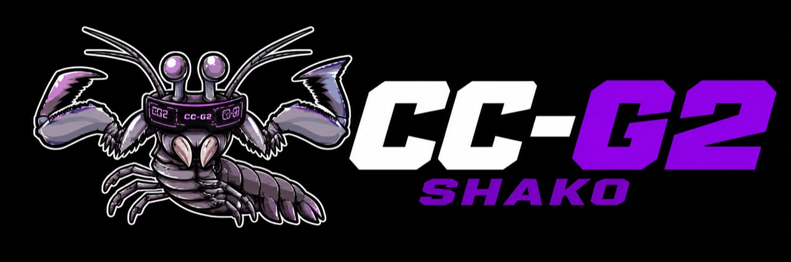
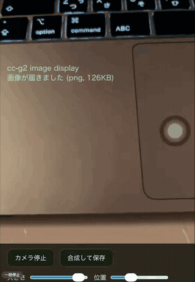

# cc-g2 — Smart glasses companion for Claude Code / Codex CLI / Copilot CLI

[日本語 README](./README.ja.md)

<p align="center">
  
</p>

`cc-g2` connects Even G2 smart glasses to Claude Code / Codex CLI / Copilot CLI so you can review permission prompts, send voice comments, and check completion notifications without staying at your desk.


Even G2 can open notifications, record a voice reply, and send that response back to Claude Code, Codex CLI, or Copilot CLI through the local Hub.

## What works today

- Approve / deny Claude Code / Codex CLI / Copilot CLI permission requests from G2
- Answer Claude Code `AskUserQuestion` prompts from G2 option lists
- Send voice comments back to Claude Code
- Check Claude Code / Codex CLI / Copilot CLI completion notifications on G2
- Browse recent notifications and details on the glasses
- Display images / screenshots sent from Claude Code or Codex CLI on G2 (`scripts/g2-send-image.sh`, usage prompt is auto-injected into both CLIs at launch)
- Launch Claude Code / Codex CLI sessions by voice via Even App custom AI

## Supported CLIs

cc-g2 supports Claude Code / Codex CLI / Copilot CLI. Hook mechanisms and available features differ slightly per CLI.

| | Claude Code | Codex CLI | Copilot CLI |
|---|---|---|---|
| Launch | `cc-g2` | `cc-g2 codex` | `cc-g2 copilot` |
| Hook mechanism | HTTP hook (`--settings`) | command hook (`-c hooks=`) | hooks JSON (`$COPILOT_HOME/hooks/cc-g2.json`) |
| Approve / deny (G2 & Telegram) | ✅ | ✅ | ✅ |
| AskUserQuestion answers | ✅ | — | — |
| Completion notifications | ✅ | ✅ | ✅ |
| Reply relay (tmux / herdr key injection) | ✅ | ✅ | ✅ |
| Local settlement detection (PostToolUse) | ✅ | ✅ (incl. auto_review) | ✅ |
| Voice Entry session launch | ✅ | ✅ | — |
| BYOK (local models) | — | — | ✅ (`COPILOT_PROVIDER_*`) |

- **Local settlement detection**: a manual approval in the terminal, or codex's automatic approval via `approvals_reviewer=auto_review`, is detected through the PostToolUse hook and auto-resolves the pending approval on the Hub (the Telegram buttons close and the G2 display updates).
- **Image display** (see "What works today") is Claude Code / Codex CLI only (Copilot CLI has no prompt-injection mechanism).
- Local settlement detection for Copilot CLI is implemented but not yet verified on real hardware.

## Known limitations

See [docs/known-limitations.md](docs/known-limitations.md) for details on G2 display constraints, list input quirks, and simulator vs real hardware differences.

## Architecture

cc-g2 has two transport modes.

**hub mode** (home / same LAN / Tailscale — for development, QR launch, sideloading):

```text
PC (Claude Code / Codex CLI + Hub + Voice Entry) <-> iPhone (Even App + Vite UI) <-> Even G2
```

**telegram mode** (on the go / primary path for the Store build — works without reachability to the Hub or Tailscale):

```text
Mac adapter (cc-tg bot, Hub subscriber) <-Bot API-> Telegram <-MTProto/userbot-> iPhone (Even App + cc-g2 WebView) <-> Even G2
```

- **Notification Hub** (`:8787`) handles notifications and approval flow
- **Vite UI** (`:5173`) provides the G2 companion web UI
- **Voice Entry** (`:8797`) launches sessions by voice (optional)
- **Per-CLI hooks** (Claude Code: HTTP hook / Codex CLI: command hook / Copilot CLI: hooks JSON) send permission requests to the Hub
- **Telegram adapter** subscribes to the Hub and delivers approvals, notifications, and images to Telegram → [packages/telegram-adapter](packages/telegram-adapter/README.md)

> Host / ports (the Hub and Vite bind to `0.0.0.0`; `:8787` / `:5173` / `:8797`) can be overridden with environment variables (`HUB_PORT` / `VITE_PORT` / `CC_G2_VOICE_ENTRY_PORT`, etc.).

The Hub is intended to mirror and answer explicit permission prompts. It should not broaden Claude Code / Codex CLI permissions or override user / org policy outside the normal `approve` / `deny` flow.

### Choosing a mode

| Mode | Use for | Reachability assumption |
|------|---------|-------------------------|
| **hub** | home / dev, QR launch, sideloading | iPhone → Mac (same LAN / Tailscale) |
| **telegram** | on the go, primary path for the Even Hub Store build | Telegram (no Hub / Tailscale needed) |

telegram mode reproduces the G2 experience (notification list, detail, approval, voice comment, image) over Telegram even when the iPhone cannot reach the Hub or Tailscale. See the [Telegram adapter README](packages/telegram-adapter/README.md) for setup. Telegram bot chats are not end-to-end encrypted, and the Mini App stores its Telegram session in Even App local storage, so use a dedicated agent account with 2FA enabled.

## Recommended setup

`cc-g2` works best with a setup based on **tmux + Tailscale + iPhone + Even G2**.

- **tmux** keeps the Claude Code / Codex CLI session alive and supports the reply relay flow
- **Tailscale** makes it easier for the iPhone to reach the local Hub safely. You can also use a local IP on the same WiFi, but Tailscale is convenient for remote or cross-network access
- **Moshi or similar helper notifications** are optional, but useful when you are away from your desk
- **G2 notifications** are useful for checking pending approvals and completions

Reference: <https://getmoshi.app/articles/mac-remote-endless-agent-setup>

## Requirements

- macOS recommended
- Node.js (LTS) + pnpm
- tmux
- jq
- Tailscale (optional if you disable QR-based remote access)
- Claude Code (`claude` command)
- Codex CLI (`codex` command, only for `cc-g2 --codex` / `cc-g2 codex`)
- GitHub Copilot CLI (`copilot` command, only for `cc-g2 --copilot` / `cc-g2 copilot`)

> `cc-g2` is intended for trusted networks, not public internet deployment.

## Quick start

### 1. Install

GitHub direct install:

```bash
pnpm add -g github:wmoto-ai/cc-g2
```

Source checkout install:

```bash
git clone https://github.com/wmoto-ai/cc-g2.git
cd cc-g2
pnpm install
pnpm link --global
```

### 2. Configure

```bash
cd "$(pnpm root -g)/@wmoto-ai/cc-g2"
cp .env.example .env.local
```

For a source checkout install, run the configure step from the cloned repository directory instead.

Key settings in `.env.local`:

| Variable | Purpose |
|----------|---------|
| `GROQ_API_KEY` | STT for voice comments (Groq, optional) |
| `OPENAI_API_KEY` | OpenAI Realtime Whisper STT (optional) |
| `SONIOX_API_KEY` | Soniox Realtime STT (optional) |
| `VITE_STT_PROVIDER` | STT engine: `groq` (default, REST batch), `openai-realtime`, or `soniox` (WebSocket streaming) |
| `CC_G2_VOICE_ENTRY_ENABLED=0` | Disable Voice Entry (enabled by default) |
| `CC_G2_REPO_ROOTS` | Repository scan path (default: `~/Repos`) |

Restart the infra with `cc-g2 !` after changing `.env.local`. From outside the tmux session, use `cc-g2 stop && cc-g2`.

### 3. Start

```bash
cc-g2
```

This starts the Hub and Vite UI, injects Claude Code hooks, prepares a tmux session, shows a QR code, and launches Claude Code.

To launch Codex CLI or Copilot CLI instead:

```bash
cc-g2 --codex     # or: cc-g2 codex
cc-g2 --copilot   # or: cc-g2 copilot
```

For Copilot CLI, set `COPILOT_MODEL` / `COPILOT_PROVIDER_*` in your environment to use a local model (BYOK) — these are propagated only to the copilot-mode tmux session.

> **First launch note**: Copilot CLI shows a folder trust prompt in the TUI; approve it to enable the hooks (G2 approvals / notifications). Codex CLI also shows a one-time "Hooks need review" prompt on the first launch after its hooks config changes — approve it.

## Commands

| Command | Description |
|---------|-------------|
| `cc-g2` | Start infra + show QR + launch Claude Code |
| `cc-g2 new` | Start in a new tmux session |
| `cc-g2 --codex` | Start infra + show QR + launch Codex CLI with G2 hooks |
| `cc-g2 codex` | Same as `cc-g2 --codex` |
| `cc-g2 --native-codex` | Legacy alias for `cc-g2 --codex` |
| `cc-g2-codex` | Alias for `cc-g2 --codex` |
| `cc-g2 --copilot` | Start infra + show QR + launch GitHub Copilot CLI with G2 hooks |
| `cc-g2 copilot` | Same as `cc-g2 --copilot` |
| `cc-g2-copilot` | Alias for `cc-g2 --copilot` |
| `cc-g2 !` | Restart infra first |
| `cc-g2 stop` | Stop Hub + Vite |
| `cc-g2 status` | Check runtime status |
| `cc-g2 doctor` | Check dependencies and services |
| `cc-g2 -p "prompt"` | Launch Claude Code with a prompt |

## Controls

| Gesture | Action |
|---------|--------|
| Swipe up / down | Move through lists, change pages |
| Single tap | Select / confirm |
| Double tap | Back / cancel / stop recording |

### Voice comment flow

1. Open the action screen and choose **Comment**
2. Speak into the G2 microphone
3. **Double tap to stop recording**
4. Choose **Send / Retry / Cancel** after STT finishes
5. **Swipe cancels recording** while recording is active

Voice comments are returned to Claude Code / Codex CLI / Copilot CLI as **deny + instruction text**.

### AskUserQuestion flow

When Claude Code asks an `AskUserQuestion`, cc-g2 opens the question directly on G2 instead of showing it as a normal notification detail.

1. Read the question on G2
2. Swipe through the available options
3. Single tap to choose an option
4. For multiple questions, answer each question in sequence
5. Choose **Other (voice)** if you need to dictate a free-form answer

Selected answers are sent back through the Hub as an answer payload for the matching Claude Code prompt.

## Approval flow

```text
Claude Code / Codex CLI / Copilot CLI ─ PermissionRequest hook ─► Hub
     │                                                            │
     │                                             creates a notification / pending approval
     │                                                            │
     │◄──────────────── approve / deny / comment ─────────────── G2
```

- **Approve**: Claude Code / Codex CLI / Copilot CLI proceeds
- **Deny**: Claude Code / Codex CLI / Copilot CLI aborts
- **Comment**: returned as deny + instruction text
- **Hub not running**: falls back to the agent's normal UI / error handling

### Approval modes (nonblocking / longpoll)

The default is **nonblocking**: the hook responds immediately and the CLI's own dialog stays on screen. Decisions from G2 / Telegram reach the CLI via tmux / herdr key injection, and whichever side (local or remote) decides first wins. When you settle locally — a manual approval in the terminal, or codex's auto_review — the PostToolUse hook detects it and auto-resolves the pending approval on the Hub, so the Telegram buttons close and the G2 display updates. Approvals left unexecuted when the turn ends are swept as "ended without execution".

Set `CC_G2_APPROVAL_MODE=longpoll` in `.env.local` to restore the old blocking behavior (the hook waits for the decision). Switching modes requires a Hub restart (`cc-g2 !`).

## Voice Entry

Launch Claude Code / Codex CLI sessions by speaking to G2 via Even App's custom AI agent. Include `codex` in your speech to start a Codex CLI session.

### Setup

1. Voice Entry is enabled by default. To disable, add `CC_G2_VOICE_ENTRY_ENABLED=0` to `.env.local` and restart with `cc-g2 !`
2. Verify with `cc-g2 status` — look for `Voice entry (port 8797): running`
3. In Even App → Conversate → Custom AI Agent, set:
   - **Endpoint URL**: `http://<Tailscale hostname or IP>:8797/v1/chat/completions`
   - **Bearer token**: auto-generated on first start, check with `cat tmp/voice-entry/voice-entry-token`

Find your Tailscale address:

```bash
tailscale status --self     # hostname (recommended)
tailscale ip -4             # IP fallback
```

### Usage

Say "Hey Even, fix tests in my-repo" and Voice Entry will:
1. Transcribe your speech (via Even App STT)
2. Auto-detect the target repository
3. Launch a new `cc-g2` session

Say "continue" or "さっきの続き" to resume the last session.

Repository candidates are scanned from `CC_G2_REPO_ROOTS` (default: `~/Repos`).

## Simulator

```bash
./scripts/start-simulator.sh
```

- Opens a browser-based phone + G2 simulator on port 5173
- Add `?dev=1` to show Developer Tools / Event Log
- Use `SIMULATOR_VERSION=...` if you want to switch simulator versions

## G2 screen mirror / camera overlay viewer



Renders an approximation of what the G2 is currently showing on a 576x288 canvas (disabled by default, opt-in).

- **In-page mirror**: add `?mirror=1` to the URL opened in the Even App to show a "G2 Mirror" card
- **Remote viewer**: add `?mirrorpub=1` (or start Vite with `VITE_MIRROR_PUBLISH=1`), then open `http://<pc-ip>:5173/mirror.html` from any device on the same LAN / tailnet. The viewer only talks to its own origin's `/api` (Vite dev proxy → Hub)
- **Camera overlay (for SNS screenshots)**: getUserMedia needs HTTPS, so expose the viewer via tailscale serve:

```bash
tailscale serve --bg --https=443 http://127.0.0.1:5173
# then open https://<machine>.<tailnet>.ts.net/mirror.html in iPhone Safari
```

"カメラ開始" overlays the mirror on the camera feed with `mix-blend-mode: screen` (black becomes transparent, only the green G2 imagery shows). "合成して保存" downloads a composited PNG.

Notes: the mirror is an approximation (device font, list selection highlight, and firmware scrolling are not reproduced). Mirror rendering/publishing is automatically deferred during image transfers for device stability.

## Development

```bash
pnpm hub:watch
pnpm dev
pnpm test
pnpm run test:all
pnpm test:watch
```

## Troubleshooting

- Run `cc-g2 doctor` to check dependencies and service health
- **After a PC restart, run `cc-g2 !`** to restart all services — Hub and Voice Entry tokens can get out of sync after a reboot
- If Voice Entry won't start: check `cc-g2 status` and make sure `CC_G2_VOICE_ENTRY_ENABLED=0` is not set in `.env.local`
- If Even App can't connect: verify the Bearer token with `cat tmp/voice-entry/voice-entry-token` and check Tailscale connectivity
- If Hub history files grow too large: stop the Hub (`cc-g2 stop`), then run `node scripts/prune-hub-history.mjs --dry-run` to preview and `node scripts/prune-hub-history.mjs` to prune (keeps 14 days by default, with automatic backup)
- To see diagnostic logs: the URL parameter `?logmirror=1` (or the build-time `VITE_LOG_MIRROR`) mirrors info-level logs onto the screen. This is **for diagnostics only — do not use it routinely** (it increases log volume and may render sensitive information on screen)

## Acknowledgments

- [Visionote](https://github.com/takashicompany/visionote) — Image rendering on G2 via Even Hub SDK; referenced for the image display pipeline
- [EvenAI Anthropic Bridge](https://github.com/jase-perf/evenai-anthropic-bridge) — Claude API bridge for G2; referenced for the Voice Entry (custom AI agent) integration

## Links

- [Known limitations](docs/known-limitations.md)
- <https://getmoshi.app/articles/mac-remote-endless-agent-setup>

## License

MIT
